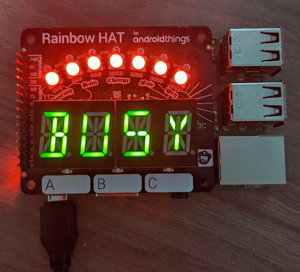

# Office Status Indicator

## Summary

This is a project to create a Google Calendar integrated status indicator for home office use, based on the [original project from TheAlanNix](https://github.com/TheAlanNix/office-status-indicator).  It has been modified to use a [Pimoroni Rainbow HAT](https://shop.pimoroni.com/products/rainbow-hat-for-android-things) instead of a [Unicorn HAT Mini](https://shop.pimoroni.com/products/unicorn-hat-mini) because...well, I had one lying around.



This project utilizes the following hardware:
- [Raspberry Pi 3b+](https://www.raspberrypi.com/products/raspberry-pi-3-model-b-plus/) (but should work with any Pi)
- [Pimoroni Rainbow HAT](https://shop.pimoroni.com/products/rainbow-hat-for-android-things)

## Requirements

- A Google Project with the Calendar API enabled
- The json file from a Native App OAuth Client (*not* a Service Account Credential)

### Optional
- Docker installed on your Raspberry Pi


## Setup

First, you'll need to create a Google Calendar API project.  There's a good tutorial [here](https://developers.google.com/calendar/quickstart/python).  Download the `credentials.json` file for the OAuth Client - you'll need it to allow the application to access your Google calendar - and then either copy the file to your `data/` directory, or mount the file to the container from the host.

### Run as a system service
Install the required packages by running `sudo pip install -r requirements.txt` 

Make sure everything works as expected by manually invoking the `office_status_indicator.py` script.  

Once you've confirmed that the configuration is correct, configure the service:
```
sudo cp office-status.service /etc/systemd/system/
sudo systemctl enable office-status
sudo systemctl start office-status
```

### Run as a container (Needs Fix)

**This method does not currently work with this code as-is; will fix later.**

On the Raspberry Pi, run the following command to download and run the container:
```sh
docker run -it \
           --name office-status \
           --privileged \
           --restart=always \
           --volume $(pwd)/data:/app/data \
           --volume $(pwd)/data/credentials.json:/app/data/credentials.json:ro \
           alannix/office-status:latest
```

This will prompt you to visit a URL to authorize the script to have access to your Google Calendar.  Once you have gone through the authorization process, you'll receive an authorization code that you'll need to provide back to the application.  The authorization code is stored within the container, so you can safely exit (Control + c) and the container will restart and continue to run.

Once the application is authorized, it will check your Google Calendar for events every minute, determine if you're in a meeting, then update the state of the status light accordingly. 

## Configuration

You can tweak the operation of the script by providing any of the following environment variables:

| Name | Description | Type | Default |
|------|-------------|------|:---------:|
| OFFICE_STATUS_HOUR_START | The hour of the day that the status light should activate. | Integer | 8 |
| OFFICE_STATUS_HOUR_END | The hour of the day that the status light should de-activate. | Integer | 18 |
| OFFICE_STATUS_TZ | The timezone that should be used to determine working hours. | String | "America/New_York" |
| OFFICE_STATUS_WARNING_MINUTES | The number of minutes prior to the next meeting that the light should change to 'warning' status. | Integer | 10 |
| OFFICE_STATUS_WEEK_START | The integer representation of the day of the week to start the work week (Monday is 0 and Sunday is 6) | Integer | 0 |
| OFFICE_STATUS_WEEK_END | The integer representation of the day of the week to end the work week (Monday is 0 and Sunday is 6) | Integer | 4 |

## TODO
- Add steps for creating Native OAuth Client ID
- Get container working with Rainbow HAT (library issue with python3-smbus)
